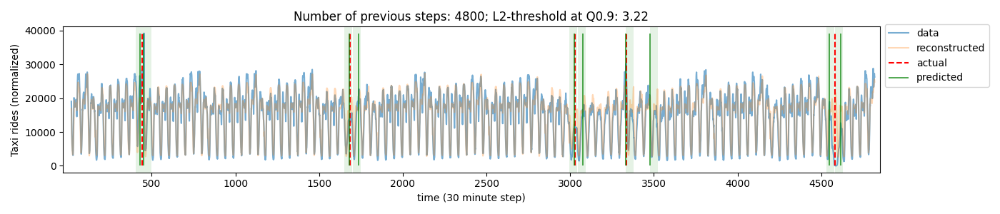

## TS VAE-LSTM

Implementation of the paper [Anomaly Detection for Time Series Using VAE-LSTM Hybrid Model](https://ieeexplore.ieee.org/document/9053558) 

#### Usage
> Hydra configurations to reproduce the results provided in `config`. 

Clone. After setting up the environment with `pipenv` or others, update the paths (hydra) to the datasets and hyperparams for experimentation.
run the scripts in order: `train_vae.py` -> `train_lstm.py` to generate the prerequisite models.
Followed by the inference script: `run_ad.py` to generate the plots and logs. All outs will be written to `models/`.

#### Results from NYC Traffic dataset

At time $t$, past $k$ window(s) of length $p=48$ are taken. The VAE-LSTM reconstructs the past windows and if the true time series deviates from the reconstructed time series, the $k^{th}$ window is marked as an "anomalous window".  

VAE-LSTM is trained on a time series without anomalies so any deviation beyond the 90th quantile of reconstruction error (L2 norm) is considered an anomaly.

In the figure, blue lines represent the unseen data. Orange lines correspond to the reconstructed data. Red dashed lines are the true labels in the unseen set. Green window is the region where anomaly was predicted. Green line is the first time anomaly was flagged in the window.

 

## Misc

#### TODO
- [x] Training and inference scripts (#1)
- [x] Separate training from notebooks
- [ ] Fix github-actions
  - [ ] Page deployment
  - [ ] CI tests
  - [x] precommit
- [x] Build complete AD pipeline
- [x] include fine-grained threshold with quantile for within window detection.
- [x] use a squared term if the absolute element-wise error falls below delta and a delta-scaled L1 term otherwise (Huber)
- [x] Use dotenv `.env` to manage paths
- [x] Plot has a shift of 21 due to remainder -> todo
