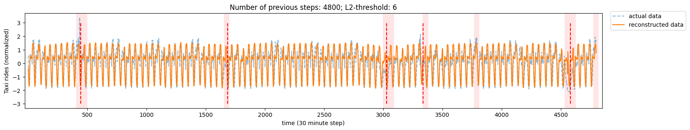

# TS VAE-LSTM


> Implementation of the paper [Anomaly Detection for Time Series Using
> VAE-LSTM Hybrid Model](https://ieeexplore.ieee.org/document/9053558)

This is a work in progress.

#### TODO

- [ ] Separate training from notebooks
- [x] Build complete AD pipeline
- [ ] include fine-grained threshold for within window detection.
- [x] use a squared term if the absolute element-wise error falls below
  delta and a delta-scaled L1 term otherwise (Huber)
- [x] Use dotenv `.env` to manage paths

<!-- WARNING: THIS FILE WAS AUTOGENERATED! DO NOT EDIT! -->

#### Installation

``` sh
pip install ts_vae_lstm
```

#### Results from NYC Traffic dataset

At time $t$, past $k$ window(s) of length $p$ are taken. The VAE-LSTM
reconstructs the past windows and if the true time series deviates from
the reconstructed time series, the $k^{th}$ window is marked as an
“anomalous window”.

VAE-LSTM is trained on a time series without anomalies so any deviation
beyond a threshold (L2 norm) is considered an anomaly.

In the figure, red dashed lines are the true labels in the hidden set.
Pink window is the region where anomaly was predicted.



## Misc

### Env variables

``` bash
BASEDIR='<your-base-path>/ts_vae-lstm'
MODELDIR=${BASEDIR}/models
VAE_MODEL=${MODELDIR}/<best-vae-model>.pth
LSTM_MODEL=${MODELDIR}/<best-lstm-model>.pth
```

### CUDA setup

Download the driver and cuda version compiled for the driver.

``` bash
sudo mhwd -i pci video-nvidia-470xx
sudo pacman -U https://archive.archlinux.org/packages/c/cuda/cuda-11.4.2-1-x86_64.pkg.tar.zst
```
